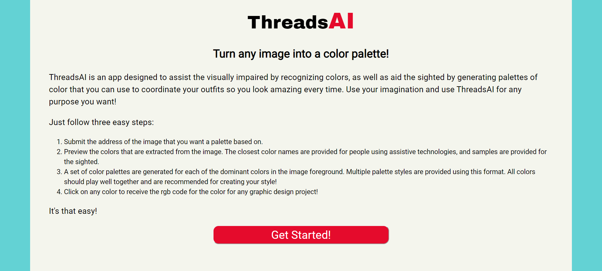
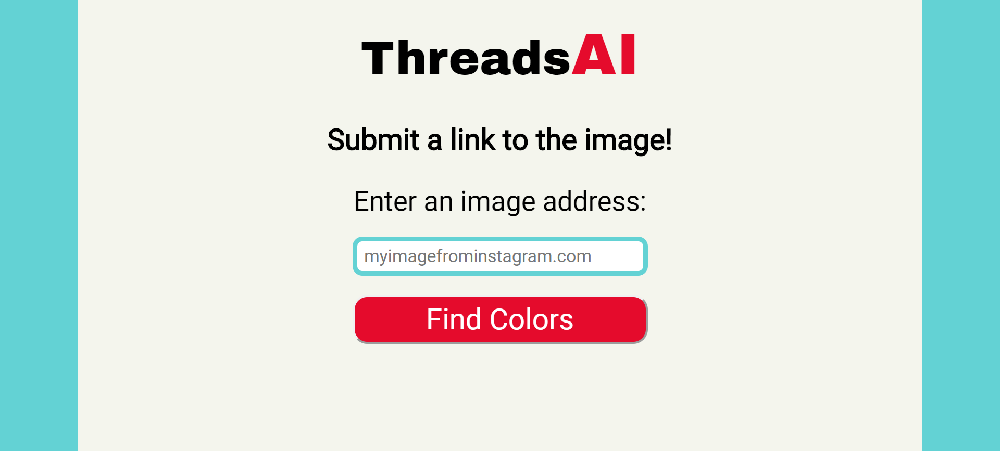
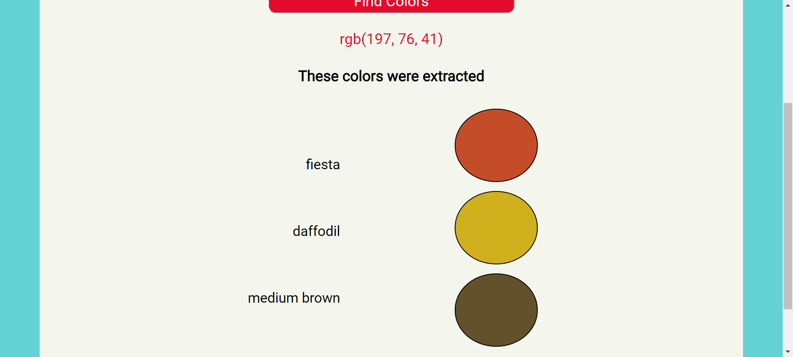
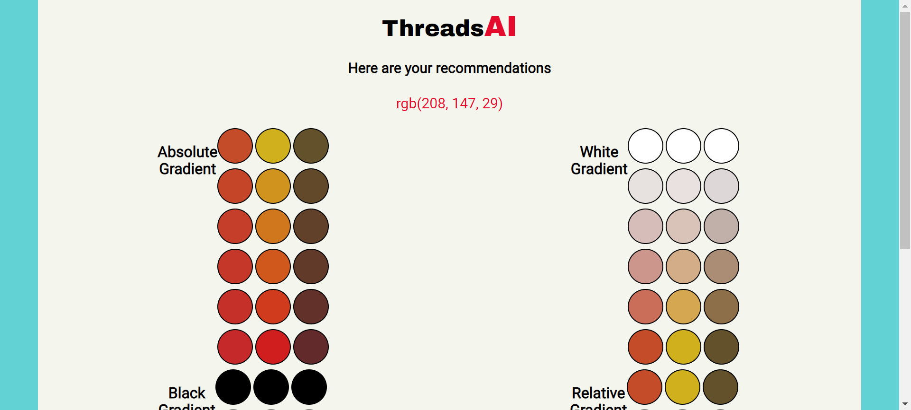

# ThreadsAI

ThreadsAI is a mobile-first web app that uses a computer vision API and a JavaScript Library to extract colors from images and create color palettes from them.

## Summary
This is intended to assist the visually impaired as well as the sighted in coordinating clothing.  The app also has the ability to provide the rgb values of any color it extracts or generates to assist graphic designers and developers in creating fantastic projects.

## Live App
[Link to ThreadsAI](https://ryanjaffe.github.io/threadsAI)

## Screenshots
Instructions Page

Image Input Page

Extraction View

Palette Page

### Tech
ThreadsAI uses HTML, CSS, JavaScript, and jQuery.

